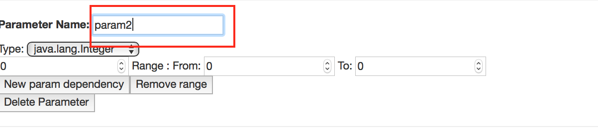
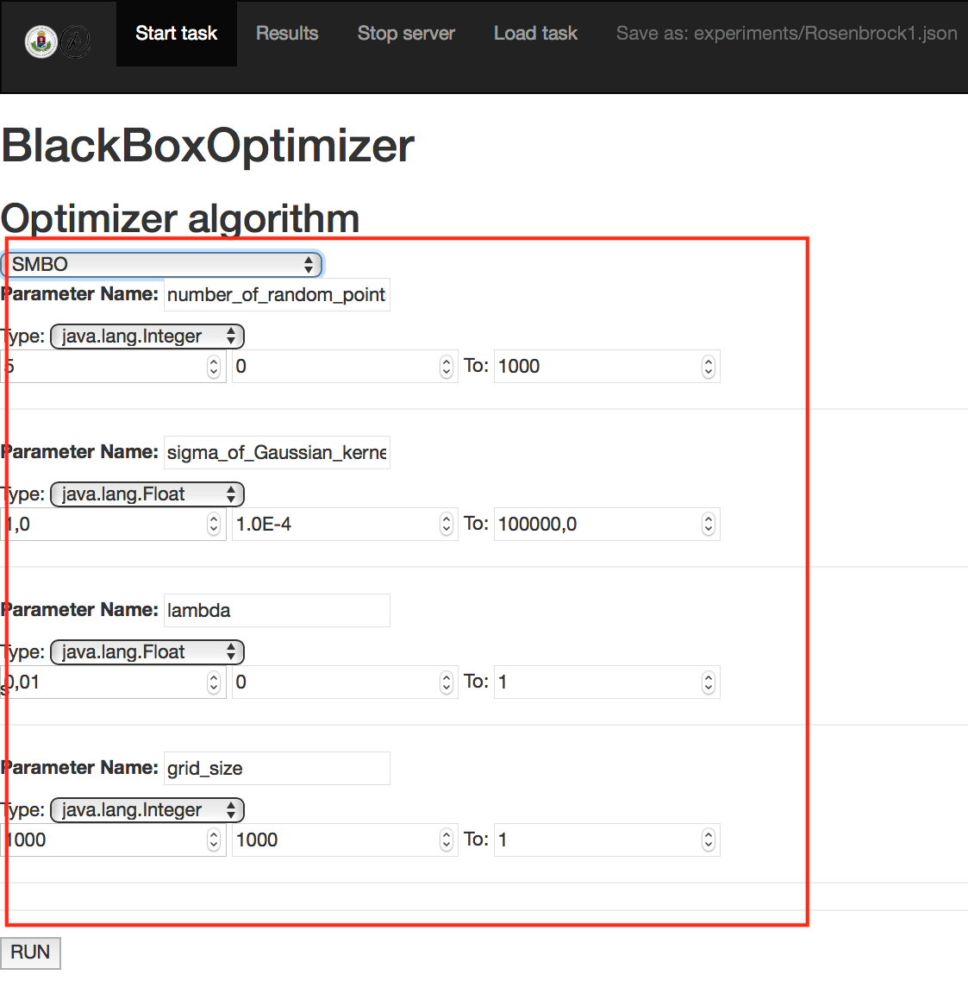

BlaBoO
=======

Welcome to BlaBoO!

BlaBoO is a leightweight optimization framework that, in current state, aims to help users to optimize or test the widest range of algorithms one may want to run.  

Install BlaBoO
--------------
0. Install [JVM 8+](https://java.com/en/download/) and [maven](https://maven.apache.org/download.cgi)

1. Download the source and navigate in the home directory (BlackBoxOptimizer).

2. Execute the following command: `$mvn package`.

3. In the `target` folder, you will find an `App` folder that contains the necessary folder structure with the single runnable `jar` file. You can copy this folder any place wherever you want in your directory structure.

Run the software with the GUI
--------------

- Start the server (this might require administrator rights):
    
    1. Simply double click on the `jar` (might not work properly, depending on the settings of your OS, see the recommended usage below).
                    
    2. (RECOMMENDED) Execute the `sudo java -jar BlaBoO-1.0-SNAPSHOT-shaded.jar` command in the `App` folder. 

- Go to `http://localhost:4567/hello` in your browser to access the GUI.

GUI menu
-

 

## Start new BBO task 

- The first thing you see here is a simple setup for an optimization task the setup file of which is stored in the `examples` folder.

- When you want to start a task from scratch you can chose `Start task` in the menu.

## Load already existing task

- You can browse and load in already prepared configurations using the `Load task` menu (if you run an experiment, its setup will be stored in the `experiments` folder, so you can find it there later).

- Here, by the `Load task` menu, you can load backups of previously performed/executed/started experiments (stored in the `backups` folder) and resume the work as if you start an experiment from the beginning.

## Results

- The results of the optimization tasks will be stored in the `results` folder while their setups are saved in the `experiments` folder.

- When the computations have been finished, the values of the objectives (measured and outputted by the black-box function) belonging to various parameter setups will be stored in the `results` folder in a `.csv` file, The name of this `.csv` file is constructed from the name of the setup file (the `.json` file) and the time the computation have been started at if a file with the same name already exists.

- In the browser, as soon as the work finished, the results will appear also in a chart that displays the objectives of the last computations. In this chart, the diagrams visualize the results stored in the `.csv` files recently located in the `results` folder. To get rid of not interesting results from the chart, you should remove the irrelevant files from the `results` folder . If you want only the visualization of one specific task/experiment, you can click on the description in the legend, what temporally removes the other charts.

- To display the recent results, if the server is running, you can use the `http://localhost:4567/results` url address in your browser as well.

Setup an experiment
-

## Command
 

- Specify the terminal command using `$<paramname>` for the parameters to be optimized.

    - for example, the `python Rosenbrock1.py $firstParam $secondParam` command will optimize the parameters called `firstParam` and `secondParam` of the black-box function called `Rosenbrock1.py`.

## Params
 

- The params annotated with `$` must be defined in the **Params** section.
    
    - In order to specify a new parameter, you have to push the **Add param** button in the **Params** section.
    
    - After you added your new parameter, you can change its name by simply editing it in the text input. Please note that every parameter denoted by `$` in the **Command** section should have a corresponding entry in this, i.e. the **Params**, section. After the parameter names in the **Command** and **Params** section matched, the GUI attempts to follow renaming and adjusts the command automatically, nevertheless it is not always possible.  
 
 

- To add a **numeric** new param:

    - Push **Add param**.

	- Specify its name and type.

	- Specify the default value and its boundaries.

- To add an **emumerated** param: 

	- Choose type `Enum`.

	- Specify the possible values separated by `;`.

	- Setup the default value and the first and last options as boundaries.

- To add an **boolean** param:

	- Choose type `Boolean`.

	- Choose the starting value.

- To add an **function** param:

	- Choose type `Function`.

	- Specify the formula generating the series of values (in `javascript` style). For now, the system handles one variable in the formula, that should be marked with '$'. That means that any string starting with an `$` will be replaced by a natural value at evaluation (`$foo` and `$bar` will be handled as the same variable). Function type, now, generates a series of numbers computed for the values `[0,1,2,..]` using the specified formula.

	- for example, the function `1/$alma` will generate a series of `[INFINITY ,1 ,1/2 ,1/3 , ... ]`, which might be used as the decreasing temperature variable through the iterations of the simulated annealing optimization algorithm.

	- The next input defines how long the generated series should be.

## Params depending on other params (beta)

- The ranges in which the parameters can "move" might be dependent on the value(s) of other parameter(s). It is possible that setting a parameter only makes sense if an other parameter has its values in a specified range (think about SVM parametrization in machine learning, where some parameters have meaning only in case of using given kernels).

- To add such dependency to a parameter, you can click on the **New param dependency** button,
 
 

- then you should choose the variable on which the given parameter depends from the selection (roll-down) menu.
 
 

 - After that, you specify the range of values for the **bounding parameter** serving as constraints for the values of the **bounded** parameter. You have also to tell, what should be the range of available values for the **bounded parameter** if the values of the **bounding** parameter is in the **bounding range**. 

 

- If there are more possible ranges/values which our parameter can take, we can add new ranges to the parameter for the different cases. If you don't specify any dependencies for one of the ranges, the system assumes that these will be the default behaviour of the parameter in cases for which none of the other dependencies complies.

 

## Objectives

- To evaluate the quality of the parameter setup, the software needs to know the value of the objective function. The system expects the black-box function to write this objective value(s) on the standard output or in a specified file from where it can be read. The format of the output line the system expects from the black-box function, for both types of outputs, is `<the name of the objective> <the value of the objective>`.

- If the black-box function writes its objective value(s) in a file, here you need to specify the file containing these values,

- The maximum number of iterations we want to allow to find the best possible setup,

- and the characteristics of the objectives to be given similarly to the **Param** descriptions. Here you can specify the type of the objective, 

 

that can be, to be **minimized**, **maximized**, **less** or **greater than**  a specific value or you can decide to stop the work if the minimization or maximization task **converges**.
 
  

 
 
The system allows to use a linear combination of multiple objectives. In this case, you can specify the importance of the target function at the **Weight** parameter.

- Be careful with objectives: if the algorithm does not submit the expected objective measurements, **the value will be set to `0`**.

## Safe mode and restart tasks

- If the **Safe mode** option at the bottom of the page is checked, the software will save the state of the optimization task at a frequency given in the next input (per iterations).

 

- If you want to repeat a task or just continue an interrupted one, you can browse a backup or a setup file (at the top of the page) in which the setup or the last state of the interrupted optimization task is stored. These files should be in the `backup` or in the `experiments` folder inside the software's working directory.

# The optimizer algorithms

- On the next page you can choose which algorithm you want to use to optimize the parameters of your black-box function. From the drop-down list you can choose between the available algorithms (the list depends on the characteristics of the task to be run, for example, the majority of the implemented algorithms are designed to handle simple floating parameter types).

  

After choosing the algorithm, you can set the parameters of the optimizer, that will be executed after pushing the **`Run`** button.
 
 

# Results (beta)

After the optimzation task terminated, the results are stored in a `.csv` file that contains the resulting objective values for each parameter setup the system has examined. In the GUI, after the termination, you will be redirected to a result page where the evolution of the objective values is visualized in a simple chart as a function of computation time.

 

Command Line Use
-

You can run tuning tasks already specified in a `json` file. To do that, navigate to the `App` directory and execute the command
`java -jar BlaBoO-1.0-SNAPSHOT-shaded.jar -r examples/commandline/SVM_python_GridSearch_cl.json `.
Here, `-r` indicates that you want to run a standalone  optimization task. Without this, the server application will be launched, thus, you can access the browser GUI and modify the setups if you want to.

You can access the safe mode from command line as well using the following flags:

- Use `-s` for default backups when, at every 10th iteration, the state of the optimization will be stored in a backup file.

- Use `-sp <frequency>` for saving the state of computation at every `<frequency>`th iteration.

Recover interrupted process
-

You can restart an interrupted process by loading the backup files that have been stored in the `App/backup` folder. That is, either you browse it from the GUI as a setup file or give as an argument in the command line mode.

Examples
-

You cen find some examples [here](readmefiles/example.md)

User support, developer support
-

If you have any question, remark or suggestion regarding the project, please don't hesitate to use the [issue tracker](https://github.com/kppeterkiss/BlackBoxOptimizer/issues) or contact us directly at axx6v4(at)inf(dot)elte(dot)hu. We are happy to get any feedback or contribution, and if you need to address problems related to parameter tuning, we would like to make sure that we can help you!

		

