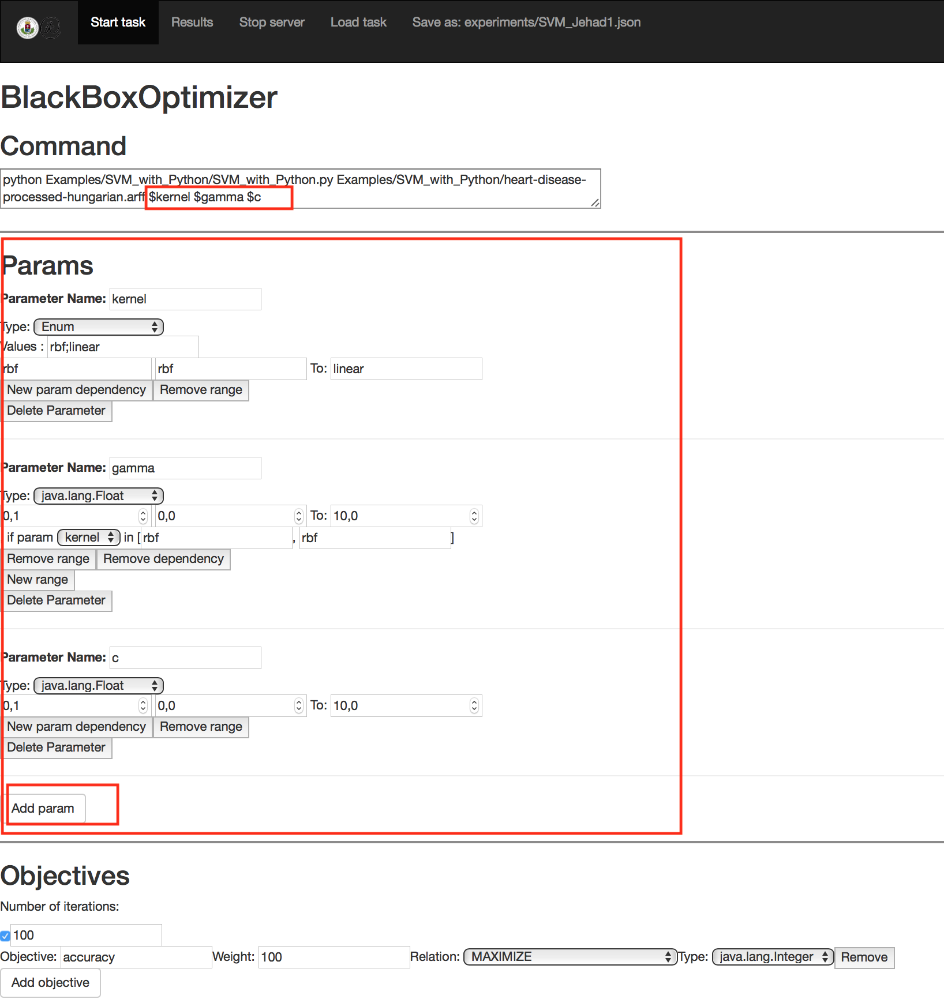
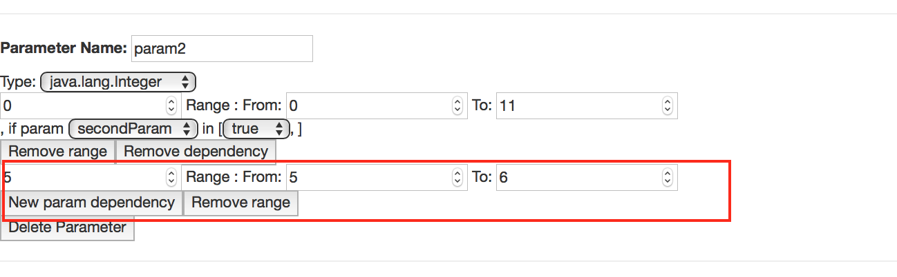
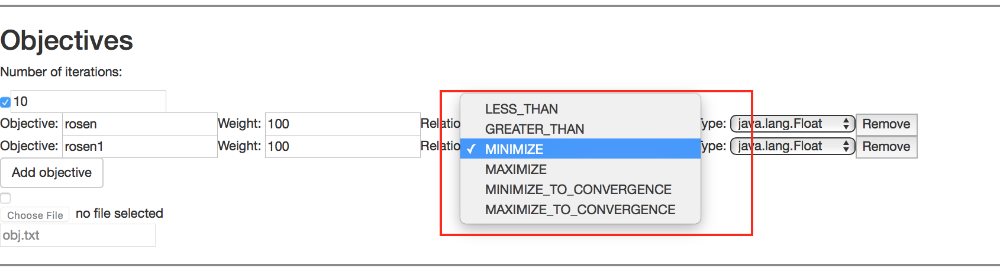
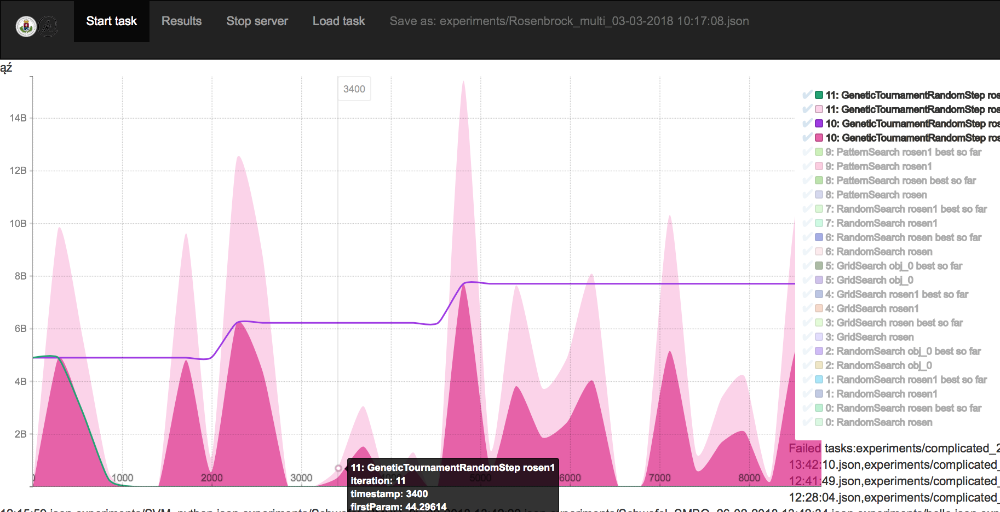

BlaBoO
=======

Weclome to BlaBoO!

BlaBoO is a leightweight optimization framework, that in current state aims to help user to optimize, or test the widest range of algorithms one may want to run.  

Install BlaBoO
--------------
0. Install [JVM 8+](https://java.com/en/download/) and [maven](https://maven.apache.org/download.cgi)

1. Download the source and navigate in the home directory (BlackBoxOptimizer).

2. execute: `$mvn package`.

3. in the `target` folder you will find an `App` folder that contains the necessary folder structure with the single runnable `jar` file. You can compy this folder any place you want.

Run the software with GUI
--------------

- Start the server (this might require administrator rights):
    
    1. simple double click on the jar .
                    
    2. from command line in the `App` folder execute `sudo java -jar BlaBoO-1.0-SNAPSHOT-shaded.jar`

- go to `http://localhost:4567/hello` to access the GUI.

GUI menu
-

## Start new BBO task 

- The first thing you see here is a simple setup for an optimization task, whose setup file is stored in the examples folder.

- When you want to start a task from scratch you can chose `Start task` menu.

## Load already existing task

- You can browse and load in already done configuration using `Load task` menu. (If you run an experiment its setup will be stored in the `experiments` folder, so you can find there later.)

- Here can you load backups from former experiments (`backups` folder) and resume the work, as if you start an experiment from the beginning.

## Results

- The results of the optimization tasks will be stored in the `results` folder, while the setups of the task are saved in the `experiments` folder

- When the computations have been finished, the values of the objectives in function of the parameter setup will be stored in the `results` folder in a csv file of a name constructed from the name of the setup file (the `.json` file) and the time the computation have been started ati f afile with the same name already exists.

- In the browser as soon as the work finished the results will appear too in a chart, that displays the objectives of the last couple computations. In this chart the diagrams visualize the results stored in the csv files located in the `results` folder recently. To get rid of not interesting results, you should remove the irrelevant files. if you want the visualization of one single algorithm you can click on the description in the legend, what temporally removes the other charts.

- To display the recent results, if the server is running you can use the `http://localhost:4567/results` url as well.

Setup an experiment
-

## Command

- Specify the terminal command using `$<paramname>` at the params to be optimized.

    - example: `python Rosenbrock1.py $firstParam $secondParam`

## Params

- The params annotated with `$` must be defined in the **Params** section.
    
    - In order to specify a new parameter you have to push the **Add param** button in the **Params** section.
    
    - After you added your new parameter, you can change its name by simply editing it in the text input. Please note, that every parameter denoted by `$` in the **Command** section should have a corresponding entry in this section. After the two names matched, the GUI attempts to follow renaming and adjust the command automatically, nevertheless it is not always possible.  

- To add a **numeric** new param :

    - Push **Add param**.

	- Specify its name and type.

	- Specify the default value	and its boundaries.

- To add an **emumerated** param: 

	- Choose type `Enum`.

	- Specify the possible values separated by `;`.

	- Setup the default value and the first and last options as boundaries.

- To add an **boolean** param :

	- Choose type `Boolean`.

	- Choose the starting value.

- To add an function param :

	- Choose type `Function`.

	- Specify the formula generating the series of values (in js style). For now the system handles one variable in the formula, that should be marked with '$'. That means that any string starting with an `$` will be replaced by a natural value at evaluation (`$foo` and `$bar` will be handled as the same variable). Formula type now generates a series of numbers computed from `[0,1,2,..]` using the formula.

		- example: 	`1/$alma` will generate a series of `[INFINITY ,1 ,1/2 ,1/3 , ... ]`.

	- The next input defines how long the generated series should be.

## Params depending on other params (beta)

- The ranges, in which the parameters can move, can depend on the value of other parameters, or it is possible that setting a parameter only makes sense if an other parameter has in a specified range. (Think on SVM parametrization in machine learning, where some parameters have meaning only in case of using given kernels.)

- To add such dependency to a parameter, you can click on the **New param dependency** button,
 

- then you should choose the variable from the select on which our parameter depends.

 - After that we specify what is the range in that this **bounding parameter** has to be in order to influence the value of our **bounded** parameter. We have to tell as well, what should be the range of available values of the **bounded parameter** if the **bounding** one is in the **bounding range**. 

- If there are more possible range/value what our parameter can take, we can add new ranges to the parameter for the different cases. If for one of the ranges we don't specify any dependencies, we can regard as that will be the default behaviour of the parameter for cases, in which none of the other dependencies complies.

## Objectives

- To evaluate the quality of the parameter setup, the software needs to know the value of the objective function. Now we expect the black-box function to write this value(s) on standard output, or in a specified file from where we can read it. The format of this file is: `<name of objective> <value>`.

- If our black-box function writes this objective value(s) in a file, here we need to specify the file contains the values,

- The maximum number of iterations we want to allow to find the best possible setup,

- and the characteristics of the objectives to be given similarly to the 'Param' descriptions. Here we can specify the type of the objective, 

that can be: to be **minimized**, **maximized**, **less** or **greater than**  a specific value, of we can decide to stop the work  if the minimization or maximization task **converges**.
 

 
 
We allow to use a linear combination of multiple objectives, in this case we can specify the importance of the target function at the **Weight** parameter.

- Be careful with objectives, if the algorithm does not submit the expected objective measurements, **the value will be set to `0`**.

## Safe mode and restart tasks

- If the **Safe mode** option at the bottom of the page is checked, the software will save the state of the optimization at a frequency given in the next input(per iterations).

- If we want to repeat a task or just continue an interrupted one, at the top of the page we can browse a backup or a setup file, in which the setup or the last state of the interrupted optimization task is stored. These files should be in the `backup` or in the `experiments` folder inside the software's working directory.

# The optimizer algorithms

- On the next page we can choose what algorithm we want to use to optimize the parameters. From the drop-down list you can choose between the available algorithms. (the list can depend on the characteristics of the task to be run, the majority of the implemented algorithms for example are designed for handling simple floating parameter types)

    

After choosing the algorithm, we can set the parameters of the optimizer, that will be executed after pushing the **`Run`** button.

# Results (beta)

After the optimzation task terminated, the results are stored in a `.csv` file, that contains the parameter setup and the result objective values. On the GUI, after the termination you will be redirected to a result page, where in a simple chart the evolution of the objective values is visualized in function of time.

Command Line Use
-

You can run tuning tasks already specified in a `json` file. To do that, navigate to the App directory and execute:
`java -jar BlaBoO-1.0-SNAPSHOT-shaded.jar -r examples/commandline/SVM_python_GridSearch_cl.json `
Here `-r` indicates that we want to run a standalone  optimization task, without this the server application will be launched, thus you can access the browser GUI and modify the setups if you want to.

You can acces save mode from command line as well using the following flags:

- Use `-s` for default backups, then at every 10.  iteration the state of the optimization will be stored in a backup file.

- Use `-sp <frequency>` for save state at every <frequency> iteration the state will be saved

Recover interrupted process
-

You can restart an interrupted process by loading the backup files that have been stored in `App/backup` folder. That is either you browse it from GUI as setup file, or give as argument in command line mode.

Examples
-

You cen find some examples [here](readmefiles/example.md)

User support
-

If you have any question, remark or suggestion regarding the project, please contact us at: axx6v4(at)inf.elte.hu. We are happy to get any feedback or contribution.

		

