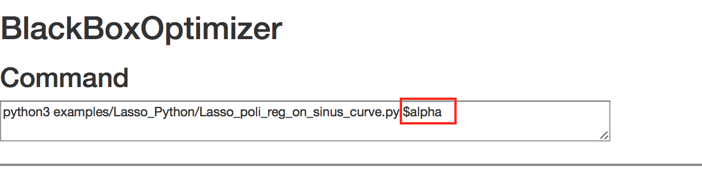
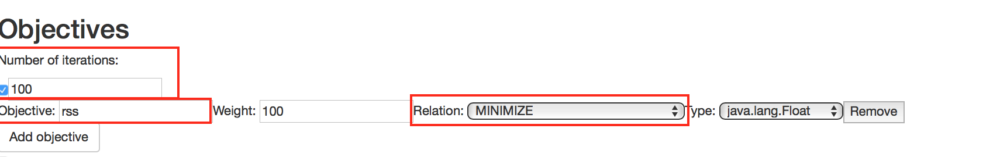
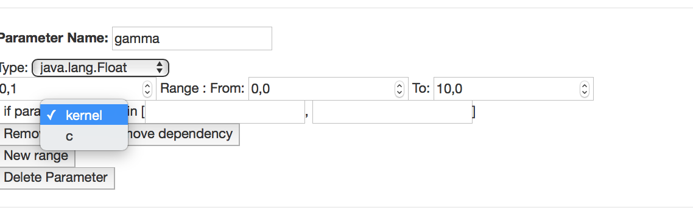

Examples
-

In the `examples` folder, within the project home directory you can find a couple of example project, each conatin a file  corresponding to the black-box function(**BBF**) (potentially along with other files for instance when BBF processes an input file), and the setup `json` file. The test codes are implementesd in various languages for the sake of variety: C,C++,Python,R, and Java.

Examples include a couple of simple functions, that are widely used at testing various optimization techniques, as Rastrigin and Rosenbrock functions,  and also a number of machine learning problems, where performance of learning process can be infuenced by some parameters of the learning process, that are the **hyperparameters**.


Rosenbrock
-

## BBF setup

The setup for finding the minimum for the Rosenbrock function ([Wiki](https://en.wikipedia.org/wiki/Rosenbrock_function)) will appear when you start your GUI, that looks something like this:


In this screen you can find the following items:

1. The format the BBF function should be called from terminal, that is you can execute from the following command from the home directory of the BlaboO:

```sh
$ python Examples/Rosenbrock/Rosenbrock.py 1.0 2.0
 ['Examples/Rosenbrock/Rosenbrock.py', '1.0', '2.0']
 rosen 100.0
$ 
```
This will execute a [python script](/examples/Rosenbrock/Rosenbrock.py) at the given location, that computes the values for the function at the coordinates that have been given as function arguments.

Note however, that in the setup page of the GUI, the concrete float values are replaced by two variables, denoted by `$` :  `$firstParam $secondParam`
Values for these two parameters will be inserted by the BlaBoO optimizer. 

2. As soon as we use a variable (=parameter) in the 1. part, we have to give a description, what are the possible values that can get there.
In the image, at number 2, we can see a specification of these two parameters in the framework.
 


A section corresponding to a parameter at first place contains a text input field for the name of the parameter(**a**),and  a selector for the type (**b**). The name should be agree with one of those in the command line, without the `$` symbol. (Please catefully copy and paste parameter names, at recent state inserting `$` character in the input field can distrurb work of the GUI page)
Once a match happened between the command line and a parameter section, the GUI tries to detect changes in any of those, and apply it on the other. 

For type we can choose between `java.lang.Float`,`java.lang.Integer`,`java.lang.Boolean`,`Enumeration` and `Function`. The first three probably have a clear meaning, to the others we will return later.

After we have chosen the type of the parameter, we should set its initial value(**c**), and the lower and upper bounds (**d** and **e**), where the value can be varied by the BlaBoO.(That is, it might not make sense to test the value at -12124214532 for a function)
 
3. Afer the above steps, we have to specify, what is the goal of our optimization task. In our case we would like to find the minimum of the function. By default we expect from the BBF to print the value of interest on the standard output, in a form that after the name of the objectives comes its value, in our case:

```sh
 rosen 100.0
``` 
In this section we have to give the name(**a**)of the target(objective) variable, as it is returned by BBF, thus BlaBoO can search for that between the possibly thousands of printed out lines. Now this is `rosen`. After that, give its type(**b**), that can be `Integer` or `Float`, for now, it is `Float`. Naturally we have to tell what we want from this objective,  e.g finding its minimal or maximal value. Here we are looking for the minimum, so we set the type of the objective to `MINIMIZE`(**c**).


4. At the end of this screen we have to specify, how long we want to run the optimization. If we want to maximize or minimize the BBF, we must give an iteration number, that is how many times we want to run the task. Here, since we just want to try out the system, can setup a very moderate 10 for this value.

Now we are done here, so we can push **OK** to go to the next phase, where we can choose between optimization strategies.


## Algorithm setup


Here just for sake of simplicity from the algorithm selector we choose **RandomSearch**, which doesn't requires any further setup, merely makes random guesses within the range of the variables and execute the BBF with those.
 
Since there is nothing more to do here, push **Run**. 

## Results


In this slightly strange chart we can see the evolution of our objective value in function of time. Why we cant see any nice convergence process here has two reasons. On one hand we only guess randomly, that is not taking into consideration past values makes the chart fluctuating. The second thing here, that due to this random guessing, the process can be run fully parallel, so we get  the results in waves, where the fluctuation is big in short time, then we are waiting for the next wave making the chart smooth between the waves.


An ML use-case: Lasso regression
-

This example demonstrates a use case, that is  a bit closer to real ML scenarios. In this setup we try to approximate a part of a perturbed sinus curve with a 
polynomial function, using [Lasso (Least Absolute Shrinkage and Selection Operator)](https://en.wikipedia.org/wiki/Lasso_(statistics)) regression. 
Lasso regression performs L1 regularization, penalizing complextity, 
in this particular case coefficients of high absolute value. Controlling to what extent we want to penalize 
complexity in Lasso regression is carried out through setting the value of an **alpha** parameter.

The code and the idea of this example is taken form [analyticsvidhya.com](https://www.analyticsvidhya.com/blog/2016/01/complete-tutorial-ridge-lasso-regression-python/).

To generate the dataset we can use the following command from the home directory of BlaBoO:

```sh
python3 examples/Lasso_Python/generate_sin_data.py
```
Then the experiment for ```alpha = 0.01``` looks like :

```sh
 python3 examples/Lasso_Python/Lasso_poli_reg_on_sinus_curve.py 0.01
```
Now we seek to find an optimal alpha value, so we will substitute `0.01` with a variable `alpha`, so the command line will look as follows:



In the **Param** section then necessary to define the `alpha` param with the range we want to search in, for now we want to try values between `0` and `0.01`. 


Finally we specify what is our target variable and what we want from that, it will be the `rss` value printed by the BBF, that should be **minimized**. Also should specify how many iteration should be run, let it be 100 for now.



Here we would like to try values evenly distributed in the given range of `alpha`. Therefore we can choose `GridSearch` from the algorithm page, and set the `stepsize` belonging to `alpha` to the length of the range of `alpha`, devided by the number of trials we want to run (that is the iteration count we gave in the **Objective** section)


When the execution of trials is completed, we can see a result chart (again a bit messy due to parallelization, see previous example), where we can find, that we achieved the best results at `alpha = 0.00001`.


Dependent parameters - SVM
-

In certain cases, parameters are used only in specified circumstances, namely if another parameter fulfills some conditions. We call those parameter **dependent** or **bounded parameters**, while the other one is the  **bounding parameter**. 
The problem with the bounded parameters is, if we could not define these dependencies for the tuning process, the optimizer can keep trying to modify these parameters and run potentially hundred of trials without any effect, since that doesn't change the behaviour of the BBF.

This example serves as an illustration for this problem, where we want to play around with parameters of [Support Vector Machine (SVM)](https://en.wikipedia.org/wiki/Support_vector_machine). In the example we wan to perform classification on a [heart desease dataset](/examples/SVM_with_Python/heart-disease-processed-hungarian.arff) with a [python script](/examples/SVM_with_Python/SVM_with_Python.py) that uses the [scikit-learn](http://scikit-learn.org/stable/modules/svm.html) implementation of SVM.
SVM finds the maximum-margin hyperplane that separates classes in the data. If the data points are not linearly separable, we can use the kernel trick, that transform the data into some higher dimensional space where separation is expected to be easier. Different kernels however have different parameters, and that is where we will apply parameter dependence.
In the example script we try to separate classes using **linear** and **rbf kernels**. Both kernels expext some `C` penalty parameter for misclassification, that works similarly as in the Lasso example, but in **rbf** kernel we also can set a `gamma` parameter whose effect can be described as specifying to what extent a given training example infuences the learning.

Now if we are using **rbf** we can play with `gamma` parameter, that on other hand is in vain in case of **linear** kernel, and would result in a number of superfluous trials. 

So now we want to setup an experiment like follows. First we specify the parameters (`kernel`, `gamma` and `c` ) with their types (`Enum`,`Float`and `Float` respectively), as previously, along with the command to execute, and the objective `acccuracy` that we want to minimize:


Now we add the dependency to the parameter `gamma`, pushing the button **New parameter dependency**,


Then we chose from the list of other parameters the one, that will bound `gamma`, that is `kernel`.  



After this we give the range the bounding parameter should be in to eneble varying value of the bounded one(`gamma`) (that is, when it makes sense, since SVM kernel needs it). Now this range contains only `rbf`, so we set this for the lower and upper bound  value.


After that we can go on as usually, with choosing the algorithm and run the experiments.

## Note 1 - Bounded parameters

When we specifying dependencies, it is possible to give multiple ranges for the bounded parameter. If it would make sense, we could use another range for the case when the `kernel` is `linear`,


or when we want to use a default range, if none of the bounding conditions is not met. 


## Note 2 - Algorithm selection

Since in the setup we used a special parameter type, namely `Enum`, we can only use algorithms that are prepared to handle these types. For now therefore we can choose between `GridSearch` and `RandomSearch`. 
  

  

Random forest with R
-

In this example we will show how to use BlaBoO for an ML algorithm written in [R]((https://cran.r-project.org)). We will optimize a script which use random forests for predicting attributes of a given dataset. For our data, we are going to use the Wine Quality data set from the UCI Machine Learning Repository.

The setup for finding the optimal hyper-paremeter combination for a random forest will appear when you start your GUI, that looks  like this:


The format the BBF function should be called from terminal, that is you can execute from the following command from the home directory of the BlaboO:

```sh
$  Rscript Examples/Random_forest_R/randomforest.R $ntree $mtry $nodesize $maxnodes
 accuracy 15.63267
$
```
This will execute an [R script](/examples/Random_forest_R/randomforest.R) at the given location, that computes the values for the function at coordinates given as arguments.

Note however that in the setup page of the GUI, the exact numeric values are replaced by four variables, denoted by `$` :  `$ntree $mtry $nodesize $maxnodes`
Values for these two parameters will be inserted by the BlaBoO optimizer. For more information about the meaning of these parameters see https://cran.r-project.org/web/packages/randomForest/randomForest.pdf .


